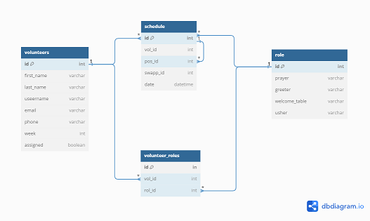

# The Scheduler

***The Scheduler*** was born out of the need for a more robust volunteer scheduling system for my church. The app manages the scheduling of the volunteer for the church by enabling a user to add, modify, and delete a volunteer and/or schedule and query the schedule by date and/or username. Ideally only people with admin privileges will be able to make any changes to the schedule. However, everyone will be able to query the schedule by date and username. Currently there are no admin privileges set for the app so everyone has full access.

The Scheduler consist of 4 tables: 
- Volunteer
- Schedule
- Role
- Volunteers_Roles

## Schedule

- id primary Key
- date 
- swapp_id 
- vol_id foreign key
- role_id foreign key

Because Schedule has a one-to-many relationship with Volunter and Role foreign keys were create for both tables to manage the relationship

## Volunteer

- id primary key
- first name
- last name
- username 
- email
- phone
- week
- assigned

 Besides a primary key the volunteer table has two relational fields. *roles* is used for managing the relationship between the Role and Volunteer tables through the association table, *Volunteers_Roles* 

*schedules* is use is used to manage the relationship to between Schedule and Volunteer tables. 

- roles = relationship('Role', secondary='volunteer_role',
                          back_populates='volunteers')
- schedules = relationship('Schedule', backref=backref('volunteer'))

## Role
- id primary key
- prayer 
- greeter
- welcome table 
- usher

Like the Volunteer table the Role table has two relational fields. *volunteers* which manages the relatationship between Role and Volunteer through the association table *Volunteer_Roles*

*schedules* is used to manage the relationship between Schedule and the Role tables.

- volunteers = relationship('Volunteer', secondary='volunteer_role',
                          back_populates='roles')
- schedules = relationship('Schedule', backref=backref('role'))

## volunter_Roles
- vol_id foreign key
- rol_id foreign key

Volunteer_Roles is an association table that manages the relationship between Volunteers and Roles. 

The Scheduler is a *Command Line Interface* or cli app so the user interacts with it from the command line.  The cli file that envokes the scheduler is...*wait for it*...**scheduling.py**

Ok, I can see you're not impressed, so lets take a look at what this does and see if we can change your mind!

Because the The Scheduler is a cli the interface is very simple but effective. It begins with a menu that allows you to select the action you want to perform. 

## Add Volunteer

When the user selects Add Volunteer they are taken to the "Add Volunteer" screen where they are prompted to enter specific information about the user to be added to the database. Notice at every prompt is the opportunity to quit the application by hitting x except the last prompt, that's because by then the user is most likely commited to the process. 

It finishes by displaying a message saying they have been added to the Scheduler containing the user's name, *username* which is created internally, and the role they'll be serving in. The user then hits enter to exit and return to the menu.

Notice Tom Cruise #41 in the volunteer database:

## Delete Volunteer
Tom Cruise has become very busy working on "Mission Impossible: Maverick" so we're going to remove him and give him the space he needs to film the moving.

As you can see Tom has been removed and free to persue his acting career.

## Modify Volunteer

Mary Spalding has just been married and wants to change her lastname, email handle and role. 

What you see below is the purpose of the Volunteer_Role table. Mary's id is 44 and right now she's a greeter and the greeter id is 1. So association table *(Volunteer_Roles)* is associating Mary's id with the greeter id.

Notice Mary's current role as greeter was listed. It's important to remember there is not foreign key for role.id in the Volunteer table. The Scheduler is able to list the greeter in association with Mary because of the Volunteer_Role table. 

The Scheduler is processing the changes and prints the message "Change was successful".  The user then hits enter to exit and return to the menu.

Now let's take a look at the database.

volunteer_Roles:
Mary's role association has changed from 1 (greeter) to 2 (usher)

Mary's last name changed to Spalding-Wilson and her email changed to spalding_wilson@gmail.com

*ok, moving on...*

## Add to Schedule
Let's add Mary to the schedule.   

Hmmm... looks like someone forgot Mary is not longer a greeter. Remember she changed her role to usher. 

Mary Spalding has been successfully added to the schedule.
Let's check the Schedule table to make sure:

Remember the Schedule contains two forgien keys; one for Role and one for Volunteer.  We see Mary's id, 44 and the role id for usher which is 2.  We see the date is the date entered, 2023-09-03.

## Modify Schedule

Mary has decided she will not be in church on Sep 3 so she'll need to change the date.

Now let's check the Schedule to make sure the date has been changed.

Yes! The date was changed from 2023-09-03 to 2023-09-10

## Delete Schedule

The church will not need an usher on 2023-09-10 so we will delete Mary's schedule. 

