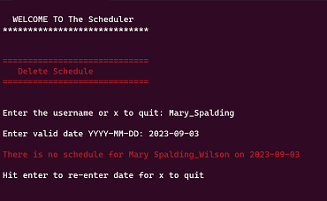

# The Scheduler 

***The Scheduler*** was born out of the need for a more robust volunteer scheduling system for my church. The app manages the scheduling of the volunteers by enabling a user to add, modify, and delete a volunteer or schedule, and query the schedule by date or username. Ideally only people with admin privileges will be able to make any changes to the schedule however, everyone will be able to query the schedule by date and username. Currently there are no admin privileges set for the app so everyone has full access.

The Scheduler consist of 4 tables: 
- Volunteer
- Schedule
- Role
- Volunteers_Roles

## Schedule

- id primary Key
- date 
- swapp_id 
- vol_id foreign key
- role_id foreign key

Because Schedule has a one-to-many relationship with Volunter and Role, foreign keys were create for both tables to manage the relationship

## Volunteer

- id primary key
- first name
- last name
- username 
- email
- phone
- week
- assigned

 Besides a primary key the volunteer table has two relational fields.
 
 roles* is used for managing the relationship between the Role and Volunteer tables through the association table, *Volunteers_Roles* 

*schedules* is used to manage the relationship between the Schedule and Volunteer tables. 

- roles = relationship('Role', secondary='volunteer_role',
                          back_populates='volunteers')
- schedules = relationship('Schedule', backref=backref('volunteer'))

## Role
- id primary key
- prayer 
- greeter
- welcome table 
- usher

Like the Volunteer table the Role table has two relational fields. 

*volunteers* which manages the relatationship between Role and Volunteer through the association table *Volunteer_Roles*

*schedules* is used to manage the relationship between Schedule and the Role tables.

- volunteers = relationship('Volunteer', secondary='volunteer_role',
                          back_populates='roles')
- schedules = relationship('Schedule', backref=backref('role'))

## volunter_Roles
- vol_id foreign key
- rol_id foreign key

Volunteer_Roles is an association table that manages the relationship between Volunteers and Roles. 

The Scheduler is a Command Line Interface or *cli* app enabling the user interacts with it from the command line. The cli file that envokes the scheduler is **scheduling.py**

Because the The Scheduler is a cli the interface is very simple but effective. It begins with a menu that allows you to select the action you want to perform. 

## Add Volunteer

When the user selects Add Volunteer they are taken to the "Add Volunteer" screen where they are prompted to enter specific information about the user to be added to the database. Notice at every prompt the opportunity to quit the application by hitting x except the last prompt, that's because by the time the user reaches this point they are most likely commited to the process. 

It finishes by displaying a message containing the user's full name, *username* which is created internally, and the role they'll be serving in. The user then hits enter to exit and return to the menu.

## Delete Volunteer
Tom Cruise has become very busy working on "Mission Impossible: Maverick" so we're going to remove him and give him the space he needs to film the movie.

## Modify Volunteer

Mary Spalding has just got married and wants to change her lastname, email handle and role. 

The Scheduler guides Mary through a series of steps to determine the field(s) to change and verifying the *change data* as it's entered. Once the data is verified messages are printed to the screen showing the changes being processed and concluding with the message ***Change was successful***.  The user then hits enter to exit and return to the menu.

## Add to Schedule
Let's add Mary to the schedule.   

Hmmm... looks like someone forgot Mary is no longer a greeter. Remember she changed her role to usher. 

Mary is given the opportunity to enter another role or hit 'x' to quit.  Mary chooses to continue by entering the correct role, and the process ends with a message letting Mary know she's been added to the schedule.

## Modify Schedule

Mary has decided she will not be in church on Sep 3 so she'll need to change the date.

Again, Mary is lead through a series of prompts while the data entered is being validated and proceesed. The app conclude with a message the date has been changed. 

## Delete Schedule

Mary decided she wants to be removed from the schedule for that day.  

Someone forgot Mary had previously changed her date from Sept 3 to Sept 10.

 
  ## Query Schedule by Date

 Let's see if anyone else is scheduled for Sep 10:

 

 Let's use a date that actually has somone scheduled:

 

 Great!!!

 Now let see if Mary is on the schedule

 

 Oops! I misspelled her name but the app allowed me to re-enter it.  As we see Mary is no longer on the scheduler.

 Lets see if Kara Rivera is scheduled to serve:

  

  Kara is serving in multiple roles on multiple dates. 

## Testing

There are a lot of moving parts to this app because of the validation needed to ensure it's integrity. Because of that I did quite a bit of testing to make sure it would hold up under reasonable usage. However, I found bugs even as I walked through the app while writing this Readme. Unfortunately, as the developer I most surely developed *(pun intended)* blind spots. Ideally, I would have had someone not familiar with the app, walk through it just to see how it would hold up under real world experience. 

## What's Next?

 if you look in model.py You will see 3 methods that are not on the menu. I left them off because of the scope of the project. Though they're already coded and working I still would need to put in the cli code to handle them. The cli already has over 700 lines of code and I didn't want to add more for my instructors to evaluate You're welcomed!!!

 **Swap** - Notice the schedule has a swapp_id field. Sometimes volunteers swap dates. For historical purposes swapp_id would hold the id of the volunteer who was swapped out. 

  **Add Role** - There may be a need to add a role for a special event. 

 **Delete Role** - We may need to remove that role once the even was over.

 This ended up being much bigger than I thought. I'm not sure that I would add those features to this project just because its a CLI.  I believe a project like this warrants a more robust, user friendly type of interface. Who knows, maybe Flatiron will allow me to redo this project in its entirety for my capstone project! Hey, one could hope!!!

## Blog

If you're curious about the technical aspects of the The Scheduler check out my blog The Scheduler

## Update

Since this writing I've changed the banner of the app just for fun. However, the functionality has not changed so the app still works as described above.

